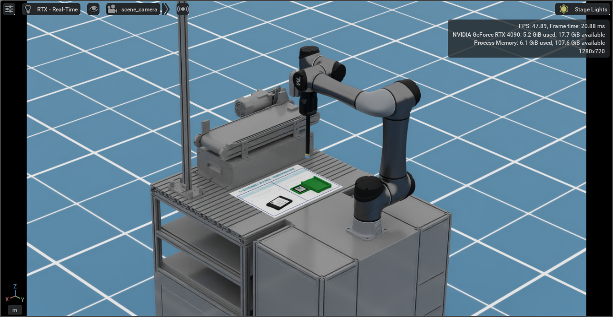

## 達明機器人 初階檢定 Omniverse及TMSimulator(TMflow)

## 介紹

**_重要:_** 此工具僅供有參加"達明機器人初階檢定"之學校使用

這一款模擬工具讓使用者能夠透過 TMSimulation(TMflow) 控制在Isaac Sim中的機械手臂。使用者在安裝了此工具後，即可直接透過預設的環境練習TMflow的操作，最終能夠順利完成達明機器人的初階檢定。

詳細安裝使用手冊請聯繫達明機器人培訓中心

