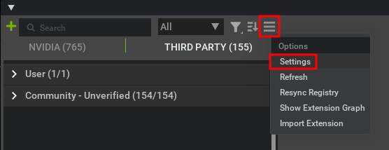
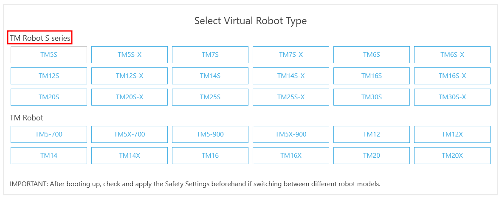
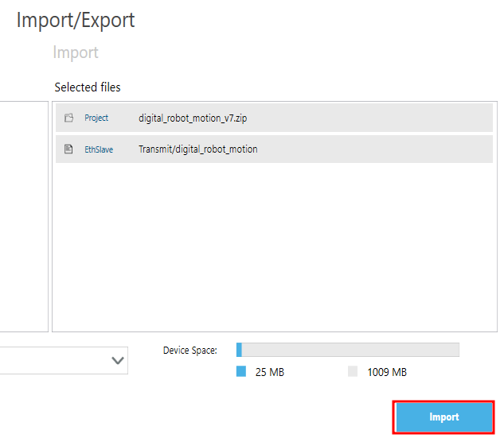
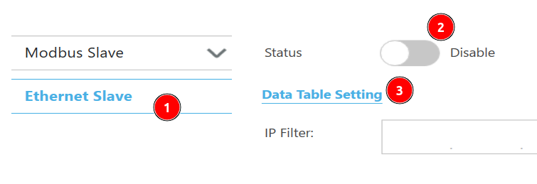
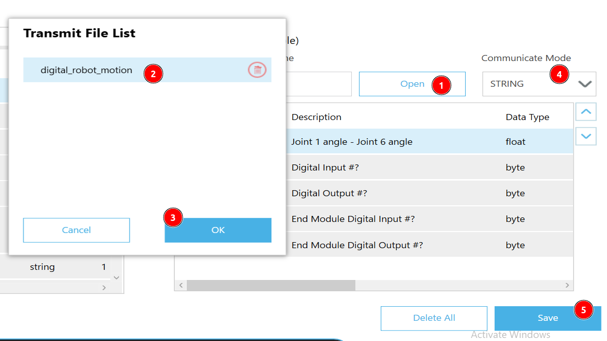

# TM Digital Robot Extension for Nvidia Omniverse Isaac Sim

## Introduction

**_Important:_** This extension is in **beta testing** and **not for production use**.

TM Digital Robot Extension is a simulation tool that enables developers to control virtual robots using TMSimulation(TMflow). It simplifies robot motion and vision application learning in Isaac Sim's virtual environment, eliminating the need for a physical robot. Pre-built Motion and Vision interfaces handle complex communication between TMRobot and Isaac Sim, streamlining integration tasks.

<!-- ## Communication Architecture

-   TBD -->

## Release Notes

Refer to the [Release Notes](RELEASE_NOTE.md) for details.

## Prerequisites

-   TMSimulator 2.22 installed on Windows 10 for TMFlow
-   Python 3.10 installed on the PC running Isaac Sim
-   Visual Studio Code installed on the PC running Isaac Sim

**Note**: TMSimulator runs only on Windows 10. Isaac Sim runs on Windows 10/11 or Ubuntu 22.04.

## Installation of Isaac Sim

-   See the [Isaac Sim Setup Guide for Windows](SETUP_WINDOWS.md) or [Ubuntu](SETUP_UBUNTU.md) for quick installation.
-   **Troubleshooting:**
    -   For detailed installation instructions, visit [Isaac Sim Python Environment Installation](https://docs.omniverse.nvidia.com/isaacsim/latest/installation/install_python.html).
    -   For startup issues, check [Isaac Sim Known Issues](https://docs.omniverse.nvidia.com/isaacsim/latest/known_issues.html).

## Installation of TM Digital Robot Extension

-   Start Isaac Sim.
-   Open **Window -> Extensions** from the top menu.
-   Click the hamburger icon -> **Settings** to access **Extensions Search Paths**.

    

-   Click **Add**, input the path where TM Digital Robot Extension is cloned, and ensure it ends with **/exts**.

    -   Example for Windows:

        

    -   Example for Ubuntu:

        

-   Go to the **THIRD PARTY** tab, find **TM Digital Robot Extension**, toggle **ENABLED**, and enable **AUTOLOAD**.

    

-   A new **TMRobot** menu will appear. Click **TM Digital Robot** to open the extension.

    

-   Drag and dock the extension to the right side for easy access.

    

-   Installation is complete.

## Setup TMSimulator

-   Launch TMSimulator(TMflow) and select a robot type in the **Virtual Robot Type** window.
-   **Supported Robots**: TM5S, TM7S, TM12S, TM14S, TM25, TM30S.

    

### Import Sample Project and Configure Ethernet

-   Copy the **TM_Export** folder to a USB named **TMROBOT**.
-   Insert the USB into the PC running TMSimulator.
-   Navigate to **gear icon -> System -> Import/Export**, then click **Import**.

    

-   Select **TMFLOW01** from the Robot List and click **Select**.

    

-   Click Import tab and then click by step below:

    -   **Project -> Whole Project**: Choose **digital_robot_motion_v7.zip**.

        

    -   **Configuration -> Ethernet Slave**: Choose **Transmit/digital_robot_motion**.

        

-   Ensure the project and Ethernet Slave are selected on the right and click **Import**.

    

### Enable Ethernet Slave Communication

-   Go to **gear icon -> Configuration -> Communication**, then click **Ethernet Slave**.
-   Disable **Ethernet Slave**, then click **Data Table Setting**.

    

-   In **Data Table Setting**:

    -   Click **Open** and select **digital_robot_motion**.
    -   Set **Communication Mode** to **STRING**.
    -   Save the settings.

    

-   Return to the **Communication** window, enable **Write Permission**, and toggle **Status** to **Enable**.

    

### Enable Virtual Camera API

-   Go to **gear icon -> Configuration -> Vision Settings**, then click **Services**.

    

-   In **Virtual Camera API**, toggle **Status** to **Enabled**.

    

Setup is now complete.
