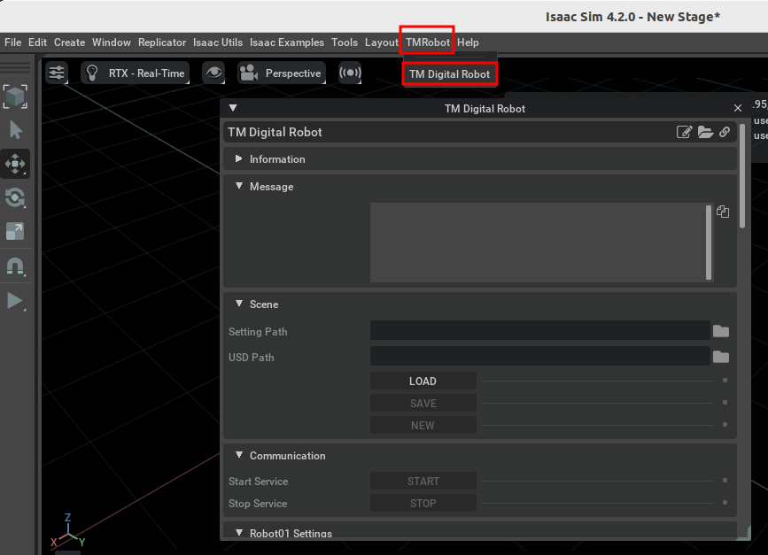
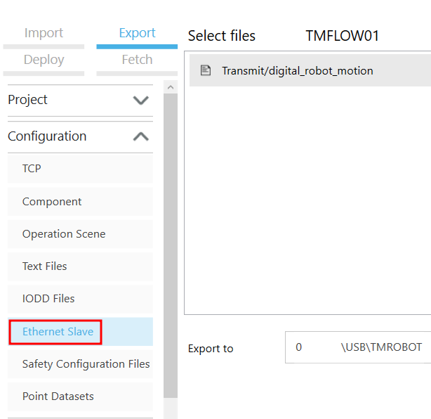

# TM Digital Robot Extension for Nvidia Omniverse Isaac Sim

## Introduction

**_Important:_** This extension is currently in **beta testing** and is **not intended for production use**.

TM Digital Robot Extension is a robot simulation tool that allow developers control virtual robot by TMSimulation(TMflow), robot controller. Developers can easily learn how control robot motion and vision applications in the virtual environment of Isaac Sim, without the need for a physical robot. The complex communication between TMRobot and Isaac Sim has been simplified with pre-built Monition and Vision interfaces, allowing developers to avoid handling intricate integration tasks.

<!-- ## Communication Architecture

-   TBD -->

## Release Notes

-   Please refer to the [Release Notes](RELEASE_NOTE.md) for the details.

## Prerequisites

-   TMSimulator 2.22 installed in Windows 10 where the TMFlow will be running
-   Python 3.10 installed in the PC where Isaac Sim will be running
-   Visual Studio Code installed in the PC where Isaac Sim will be running

**Important**: TMSimulator can be run in Windows 10 only. Isaac Sim can be run in Windows 10/11 or Ubuntu 22.04.

## Installation of Isaac Sim

-   Refer to the [Isaac Sim Setup Guide for Windows](SETUP_WINDOWS.md) for quick installation instructions.
-   Refer to the [Isaac Sim Setup Guide for Ubuntu](SETUP_UBUNTU.md) for quick installation instructions.
-   **Troubleshooting:**

    -   If you want to know more installation details from official documents, please refer to [Isaac Sim Python Environment Installation](https://docs.omniverse.nvidia.com/isaacsim/latest/installation/install_python.html)

    -   If you encounter any issues when starting Isaac Sim, please refer to [Isaac Sim Known Issues](https://docs.omniverse.nvidia.com/isaacsim/latest/known_issues.html)

## Installation of TM Digital Robot Extension

-   Start Isaac Sim
-   Click Window -> Extensions from the top menu, an Extensions window will appear
-   Click the hamburger icon on the top right corner, then click Settings, Extensions Search Paths will appear

    

-   Click the Add button, then input the path of the TM Digital Robot Extension where you have cloned the repository, please make sure the path MUST PLUS **/exts** at the end

    -   Example of setting in Windows

    

    -   Example of setting in Ubuntu

    

-   Next, click THIRD PARTY tab, find TM Digital Robot Extension, then toggle the ENABLED and check AUTOLOAD

    

-   If setup is correct, you will see a new Menu called TMRobot on the top menu, click TM Digital Robot then TM Digital Robot Extension will appear

    

-   It's the good idea to drag and dock the TM Digital Robot Extension to the right side of the window for easy access

    

-   Now, you've successfully installed the TM Digital Robot Extension

## Setup TMSimulator

-   Once you have installed the TMSimulator(TMflow), click the TMSimulator icon on the desktop to start the application, then Select Virtual Robot Type window will appear

-   Click one of the robot types you want to simulate
-   **IMPORTANT**: Currently, This extension only supports the following types of TM Robot S series: TM5S, TM7S, TM12S, TM14S, TM25 and TM30S

    

### Import Sample Project and Ethernet Configuration

##### Please find the sample project from folder **tmflow_sample_project** and import them by following guide

-   Copy folder **TM_Export** to a USB named TMROBOT
-   Insert the USB to the PC where TMSimulator is running
-   Click gear icon -> System -> Import/Export on left menu, the Import/Export window will appear, then click Import

    

-   Select TMFLOW01 from Robot List, then click Select

    

-   Click Import -> Project -> Whole Project then click digital_robot_motion_v7.zip

    

-   Click Import -> Configuration -> Ethernet Slave then click Transmit/digital_robot_motion

    

-   Finally, make sure the project and EthSlave are selected in the right side of the window and click Import

    

### Enable Ethernet Slave Communication

-   Click gear icon -> Configuration -> Communication on left menu, then Communication window will appear

-   Tick Write Permission and toggle Status to Enable

    

### Enable Virtual Camera API

-   Click gear icon -> Configuration -> Vision Settings on left menu, then Vision Settings window will appear

-   Click Services

    

-   Click Virtual Camera API tab, then toggle Status to Enabled

    

-   Now, you've successfully setup the TMSimulator

<!-- -   Import TMflow sample project **digital_robot_motion_v7.zip** from folder tmflow_sample_project to TMSimulator

-   Play the project, you will see the robot is moving

     -->

<!-- ## Usage

-   TbD -->
